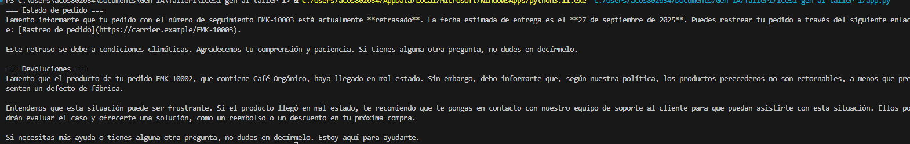

# EcoMarket — Demo de Prompts con OpenAI

Este proyecto ejecuta dos flujos de atención al cliente usando **OpenAI**:
1) **Estado de pedido** por número de seguimiento.  
2) **Flujo de devoluciones** con razón del cliente.

El script lee un **CSV de pedidos** y usa **plantillas de prompts** para construir las consultas al modelo.

---

## Requisitos

- **Python** 3.9+  
- Cuenta y **API Key** de OpenAI: `OPENAI_API_KEY`  
- Dependencias Python:
  ```bash
  pip install openai>=1.40.0
  ```

---

## Estructura del proyecto

```
.
├─ app.py
├─ data/
│  └─ orders.csv
└─ prompts/
   ├─ system_agent.txt
   ├─ order_status_prompt.txt
   └─ returns_prompt.txt
```

**Dónde va cada cosa:**
- `app.py`: script principal que carga datos, arma prompts y llama a OpenAI.
- `data/orders.csv`: “base” de pedidos para el ejemplo.
- `prompts/*.txt`: plantillas de prompts (system y user) usadas por el script.

---

## Variables de entorno

Configura tu API Key antes de ejecutar:

**Linux/MacOS (bash/zsh):**
```bash
export OPENAI_API_KEY="sk-xxxxx"
```

**Windows (PowerShell):**
```powershell
$env:OPENAI_API_KEY="sk-xxxxx"
```

> Modelo por defecto: `gpt-4o-mini`. Puedes cambiarlo con la variable `OPENAI_MODEL`.

---

## Ejecución local

1) **Instala dependencias**
```bash
pip install openai>=1.40.0
```

2) **Configura la API Key**
```bash
# Linux/MacOS
export OPENAI_API_KEY="sk-xxxxx"

# Windows (PowerShell)
$env:OPENAI_API_KEY="sk-xxxxx"
```

3) **Ejecuta**
```bash
python app.py
```

**Salida esperada (ejemplo):**
- Un bloque con **“Estado de pedido”** y el estado del pedido como tal.
- Un bloque con **“Devoluciones”** y la respuesta de si el producto de la orden se puede devolver o no. 

> Los tracking de prueba usados por `app.py` son **`EMK-10003`** y **`EMK-10002`**.
> Para probar otros, edita esas líneas en el `if __name__ == "__main__":`.

