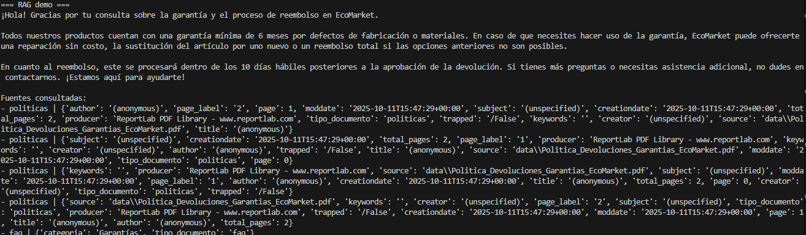
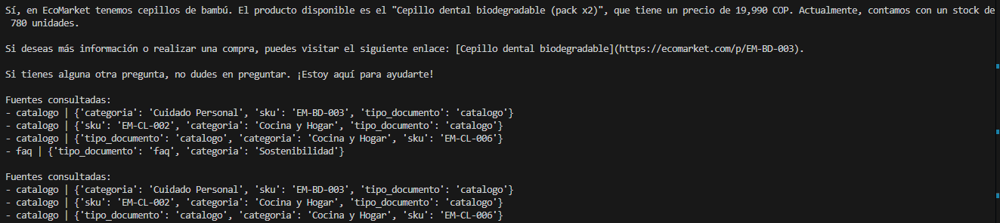
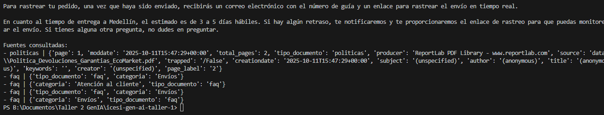

# EcoMarket - Taller RAG + Langchain

### Integrantes
- Jhonatan Estrada
- Alvaro Acosta

**Respuestas Puntos 1 y 2 en [Taller2.md](Taller2.md)**

Asistente de servicio al cliente (**RAG**) para EcoMarket que:
- Indexa políticas (PDF), catálogo (CSV) y FAQs (JSON) en **ChromaDB**.
- Recupera contexto relevante y responde con un modelo **ChatOpenAI**.
- Aplica reglas de estilo/tono leídas desde `prompts/system_agent.txt`.

> Stack principal: `langchain-openai`, `langchain-community` (Chroma), `chromadb`, `pandas`.

---

## ¿Cómo funciona?

1. **Ingesta**  
   - `load_pdf_docs(...)`: carga y trocea el PDF de políticas (p. ej. *Política de Devoluciones y Garantías*).
   - `load_csv_catalog(...)`: carga el catálogo `CSV` y crea documentos por fila/grupo.
   - `load_faqs_json(...)`: carga `JSON` de FAQs y genera un `Document` por cada Q/A.
   - Troceo con `RecursiveCharacterTextSplitter` (chunk_size=700, overlap=100).

2. **Indexación**  
   - `build_vectorstore(...)`: crea (o reutiliza) un índice **Chroma** en disco (`vectorstore/`) con embeddings de OpenAI.
   - Persistencia local para búsquedas rápidas posteriores.

3. **Recuperación + Respuesta (RAG)**  
   - `get_retriever(...)`: abre el índice y devuelve un retriever `k` documentos.
   - `rag_answer(query)`: combina **system rules** (desde `prompts/system_agent.txt`), consulta el retriever y arma una respuesta citando fuente (tipo de documento y metadatos).

4. **Demo**  
   - Al ejecutar `python app.py` se imprimen 3 ejemplos de preguntas frecuentes (garantías/reembolsos, productos de bambú, tiempos de entrega y tracking).

---

## Estructura de archivos

```
.
├─ app.py
├─ prompts/
│  └─ system_agent.txt
├─ data/
│  ├─ Politica_Devoluciones_Garantias_EcoMarket.pdf
│  ├─ catalogo_ecomarket.csv
│  └─ faq_ecomarket.json
└─ vectorstore/                 # se crea en tiempo de ejecución
```

---

## Variables de entorno

Configura tu clave de OpenAI. Por ejemplo, con un archivo `.env`:

```
OPENAI_API_KEY=sk-...
```

Y en tu shell (si no usas dotenv):

```bash
export OPENAI_API_KEY="sk-..."
```

---

## Requisitos

- Python 3.10+
- Dependencias mínimas:

```
langchain>=0.2.10
langchain-openai>=0.2.0
langchain-community>=0.2.10
chromadb>=0.5.4
pandas>=2.2.2
pypdf>=4.2.0
langchain_chroma
```

---

## Instalación

```bash
# 1) (Opcional) crear entorno virtual
python -m venv .venv
source .venv/bin/activate          # Windows: .venv\Scripts\activate

# 2) Instalar dependencias
pip install -U pip
pip install -U langchain langchain-openai langchain-community chromadb pandas pypdf python-dotenv langchain-chroma

# 3) Variables de entorno
export OPENAI_API_KEY="sk-..."     # o usa un archivo .env
```

---

## Ejecución

1. Asegúrate de colocar los archivos en `data/` y las reglas en `prompts/system_agent.txt`.
2. Ejecuta:
   ```bash
   python app.py
   ```
3. Se crearán/actualizarán los embeddings y el índice dentro de `vectorstore/` y verás en consola las respuestas de la demo.

---

## `prompts/system_agent.txt` (ejemplo)

```
Eres un agente de servicio al cliente de EcoMarket: amable, claro, conciso y empático.
Reglas:
- Usa solo la información provista en el contexto (pedidos y políticas y documentos recuperados).
- Si falta información, pide amablemente el dato necesario y no inventes.
- Cuando haya retraso, ofrece una disculpa breve y una acción concreta.
- Incluye estimación de entrega y enlace de rastreo cuando corresponda.
- Responde en español neutro y con tono profesional y cordial.
```

---

## Ejemplos de uso / salida (demo)

### 1) Garantías y reembolsos
**Entrada:**
```
¿Cómo funciona la garantía y en cuánto tiempo realizan un reembolso?
```
**Salida (ejemplo orientativo):**
```
¡Gracias por escribirnos! Para gestionar una garantía necesitamos tu número de pedido y una breve descripción del inconveniente.
Una vez recibamos el producto y confirmemos el estado, el reembolso se realiza en un plazo estimado de 5 a 10 días hábiles.
Fuentes:
- politica | {metadatos del PDF}
```

### 2) Disponibilidad y precio
**Entrada:**
```
¿Tienen cepillos de bambú y cuál es su precio y disponibilidad?
```
**Salida (ejemplo orientativo):**
```
Sí, contamos con cepillos de bambú. Precio: $X. Disponibilidad: en stock para envío inmediato.
¿Deseas que lo agreguemos a tu pedido?
Fuentes:
- catalogo | sku=..., categoria="Higiene"
```

### 3) Rastreo y tiempos de entrega
**Entrada:**
```
¿Cómo puedo rastrear mi pedido y cuánto tarda en llegar a Medellín?
```
**Salida (ejemplo orientativo):**
```
Puedes rastrear tu pedido con el enlace que te enviamos por correo al confirmar el despacho.
Para Medellín, el tiempo estimado de entrega es de 2 a 4 días hábiles.
Si necesitas el enlace nuevamente, con gusto te lo reenvío.
Fuentes:
- faq | pregunta="¿Cómo rastrear mi pedido?"
```

> Las salidas reales dependen del contenido cargado en `data/` y pueden variar.

---

## Ejemplo real de ejecución y resultados



