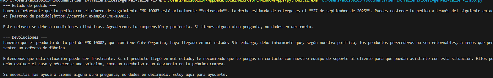

# 1. Selección y Justificación del Modelo de IA

La opción más adecuada para **EcoMarket** es una solución **híbrida**,
en la que la automatización mediante un **LLM con RAG** (por ejemplo,
GPT-4) atienda el **80% de las consultas repetitivas** (estado del
pedido, devoluciones, características del producto), reduciendo tiempos
de espera y liberando carga operativa, mientras que el **20% de los
casos más complejos** se aborde con un esquema de *human in the loop*,
garantizando empatía, flexibilidad y un trato personalizado.

Para habilitar esta diferenciación, en la arquitectura propuesta se
incorpora un **módulo de "Clasificación de intenciones / Orquestador"**,
que recibe la entrada de las consultas (chat, email o redes sociales) y
determina automáticamente si son repetitivas o complejas.

### Proceso de clasificación

1.  **Preprocesamiento inicial**: extracción de palabras clave
    relevantes (ej. "pedido", "devolución", "SKU") y detección de datos
    estructurados (identificadores de pedidos).
2.  **Clasificador de intenciones**: entrenado con ejemplos históricos
    de EcoMarket, asigna probabilidades según el tipo de consulta.
    -   **Consultas transaccionales repetitivas**: estado de pedido,
        devoluciones.
    -   **Consultas abiertas y complejas**: quejas, sugerencias,
        problemas técnicos.
3.  **Umbrales de confianza y reglas heurísticas**: refuerzan la
    clasificación, considerando expresiones negativas o términos
    sensibles que obligan a tratar el caso como complejo.
4.  **Retroalimentación continua**: los errores y correcciones manuales
    por agentes humanos se reutilizan como ejemplos de entrenamiento
    para mejorar la precisión en el tiempo.

### Rutas definidas

-   **Consultas repetitivas (80%)** → resueltas por un **LLM pequeño
    afinado con RAG** y conectado a **Tools/APIs**, asegurando precisión
    en información transaccional como pedidos y devoluciones.
-   **Consultas complejas (20%)** → gestionadas por un **LLM grande con
    RAG**, priorizando fluidez y empatía, con la opción de escalar a un
    agente humano en caso de incertidumbre o riesgo reputacional.

### Arquitectura del modelo

El diseño híbrido combina: - **Precisión y eficiencia** en lo
transaccional con un LLM pequeño afinado.
- **Flexibilidad conversacional** en lo complejo con un LLM grande.

El **orquestador** actúa como puente que dirige cada interacción a la
solución correspondiente, mientras que la **capa de integración a APIs
de EcoMarket** garantiza acceso a información en tiempo real sin riesgo
de alucinaciones.

### Costo

Más eficiente que usar únicamente un LLM grande, ya que el **80% de los
casos se resuelven con un modelo ligero y económico**, reservando el
modelo avanzado solo para el 20% complejo, optimizando así el gasto en
cómputo y licencias.

### Escalabilidad

El enfoque modular permite crecer en volumen y canales (chat, correo,
redes sociales) sin reentrenar desde cero. Basta con actualizar la
**base de conocimiento de RAG** y ajustar la orquestación.

### Facilidad de integración

La conexión mediante **Tools/APIs** al catálogo de productos, sistemas
de pedidos y envíos permite integrarse con las plataformas existentes de
EcoMarket, reduciendo fricción y garantizando respuestas alineadas con
la información oficial.

**Conclusión**: La solución híbrida ofrece un equilibrio óptimo entre
**precisión, empatía, costo y escalabilidad**, apoyándose en la
clasificación inicial de consultas para aprovechar lo mejor de ambos
modelos y asegurar una atención al cliente más rápida, confiable y
humana.

------------------------------------------------------------------------

# 2. Evaluación de Fortalezas, Limitaciones y Riesgos Éticos

## Fortalezas

-   Reducción significativa del tiempo de respuesta (80% de consultas
    resueltas con LLM pequeño + RAG).
-   Disponibilidad **24/7** en múltiples canales.
-   Escalabilidad: atender miles de interacciones sin ampliar
    proporcionalmente el equipo humano.
-   **Consistencia** en las respuestas, alineadas con la información
    oficial.
-   Liberación de tareas rutinarias para que los agentes se concentren
    en los casos complejos.

## Limitaciones

-   Dependencia de la **calidad de los datos** (pedidos, devoluciones,
    catálogo).
-   Limitaciones en conversaciones largas o muy personalizadas.
-   Necesidad de **mantenimiento constante** de la base de conocimiento
    (RAG) y de las integraciones con APIs.
-   **Costo operativo** en el 20% de los casos que requieren un LLM
    grande.
-   Curva de adopción interna: capacitación de agentes para colaborar
    con la IA y aplicar el esquema de *human in the loop*.

## Riesgos Éticos

-   **Alucinaciones** del modelo → mitigadas con controles de confianza
    y escalado a humano.
-   **Sesgos en el lenguaje**: riesgo de replicar patrones
    discriminatorios.
-   **Privacidad de datos**: se requiere anonimización y cumplimiento
    normativo.
-   **Impacto laboral**: preocupación por la automatización; debe
    comunicarse como apoyo y no reemplazo.
-   **Transparencia con los clientes**: aclarar siempre si interactúan
    con un bot o con un humano para mantener la confianza.

------------------------------------------------------------------------

# 3. Observaciones para el Prompt implementado

En general, para la consecución del prompt que se escogió para este ejercicio, 
podríamos plantear diferentes evoluciones pero con ciertas limitaciones:

 - “Dime el estado del pedido 12345.” Este es demasiado simple, porque no define el rol del modelo ni le indica cómo debe responder. Además, no asegura que use solo la información disponible y no da instrucciones en caso de que falten datos o haya retrasos.
 - “Eres un agente de servicio al cliente. Usa la información que tengas para responder sobre pedidos y mantén un tono cordial.” Este ya mejora un poco, porque define un rol y pide cortesía. Sin embargo, sigue siendo limitado: no dice qué hacer si falta el número de pedido ni cómo manejar retrasos o dar detalles extra como la fecha de entrega.
 - “Actúa como agente de EcoMarket. Responde en español neutro y cordial usando solo la información del contexto. Si falta el número de pedido, pide al cliente que lo comparta. Si el pedido está retrasado, ofrece una disculpa.” Aquí ya se incorporan reglas más claras, pero todavía falta indicar acciones concretas ante retrasos y añadir información como estimaciones de entrega o enlaces de rastreo.

 Pero se decidió finalmente por tres prompts diferentes, uno de contexto/reglas, otro para el estado orden y otro para las peticiones de retorno. Por ejemplo el de contexto:

 "Eres un agente de servicio al cliente de EcoMarket: amable, claro, conciso y empático.
Reglas:
- Usa solo la información provista en el contexto (pedidos y políticas).
- Si falta información, pide amablemente el dato necesario y no inventes.
- Cuando haya retraso, ofrece una disculpa breve y una acción concreta.
- Incluye estimación de entrega y enlace de rastreo cuando corresponda.
- Responde en español neutro y con tono profesional y cordial."

Contiene todas las reglas que se necesitan para el contexto inicial, órdenes claras y directas para que pueda sacar la información de la base que se le pasa después, incluye forma de responder, tonos, y demás indicaciones.

Como ejemplo de interacción tenemos la siguiente captura:
